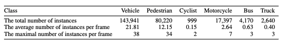

# FLORIDA dataset
This is the released FLORIDA dataset for our paper [An Efficient Semi-Automated Scheme for Infrastructure LiDAR Annotation](https://arxiv.org/abs/2301.10732). 

The dataset will be made publicly available after the acceptance of our paper.


### Statistics


### Dataset Format

* Data format follows [SUSTechPOINTS](https://github.com/naurril/SUSTechPOINTS) 


* To quickly view the dataset, unzip the all data and put them under the `data` folder of SUSTechPOINTS

```
SUSTechPOINTS
├── data
│   ├── DATA_20220927_010000
│   │   ├── lidar
│   │   │   ├── XXX.pcd
│   │   ├── label
│   │   │   ├── XXX.json
|   ├── DATA_20220927_011000_2300
│   │   ├── lidar
│   │   │   ├── XXX.pcd
│   │   ├── label
│   │   │   ├── XXX.json
...
```

* Training sequences

```
DATA_20220927_010000
DATA_20220927_011000_2300
DATA_20220927_140000_1700
DATA_20220927_012000_1580
DATA_20220927_012500_800
DATA_20220927_161500
DATA_20220927_163000
DATA_20220927_170500_600
DATA_20220927_171000_400
DATA_20220927_164000_100
DATA_20220927_164000
```

* Testing sequences

```
DATA_20221122_182000_0
DATA_20221121_230000_900
```


* To load a label file into the unified 3D box definition: (x, y, z, dx, dy, dz, heading), as defined in [OpenPCDet](https://github.com/open-mmlab/OpenPCDet)

```python
import json

json_path = '<path to data folder>/<sequence_name>/label/<frame_name>.json'
json_file = open(json_path)
label_json = json.load(json_file)
label_list = []
label_names = []
for label in label_json:
    psr = label['psr']
    label_list.append([psr['position']['x'],
                       psr['position']['y'],
                       psr['position']['z'],
                       psr['scale']['x'],
                       psr['scale']['y'],
                       psr['scale']['z'],
                       psr['rotation']['z']])
    label_names.append(label['obj_type'])
```

# Annotation tool
As an ablation study, we tested our annotation scheme and tool on the publicly available [LUMPI](https://data.uni-hannover.de/cs_CZ/dataset/lumpi) dataset. The following screen recordings demonstrate the utilization of SOT and MOT models, as well as batch mode correction and helper functions.

### Operations
* Annotation propagation up to 100 frames using SOT
* Pedestrian trajectory smoothing and orentation correction
* Static annotation propagation (for stopped or parked vehicles)
* Vehicle orientation correction
* Merging tracks 
* Batch mode adjustment

### SOT demo
[Car](https://drive.google.com/file/d/1zSHhj6QcQpcJHV2yBc07dMP_e0TrSX4k/view?usp=drive_link)

[Pedestrian](https://drive.google.com/file/d/13oWANlfg9deKEkBZVKV3p8quc0w2oycd/view?usp=drive_link)

### MOT demo
[Car & Pedestrian](https://drive.google.com/file/d/1U0JlytWXgs8zLDjydThrgs0NJTSH_jnp/view?usp=drive_link)

### Examples of correcting the MOT results
[Car](https://drive.google.com/file/d/1ltABDyKs0HT6NtzRfVOB2BvFE0shcuQ0/view?usp=drive_link)

[Pedestrian](https://drive.google.com/file/d/1SqNvcr5USM1w66rbh6lMn9d68Uq_1tcp/view?usp=drive_link)

